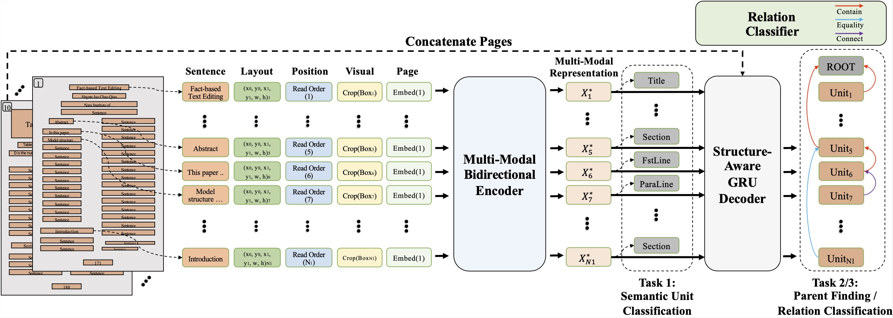
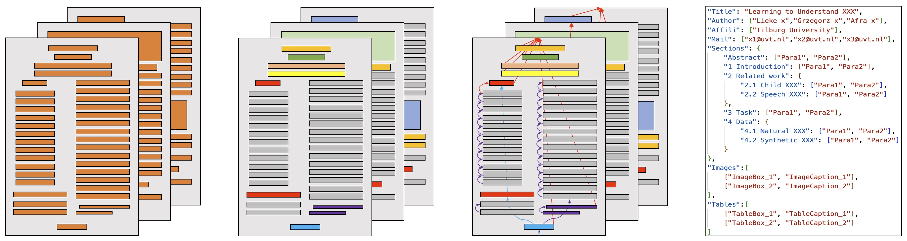
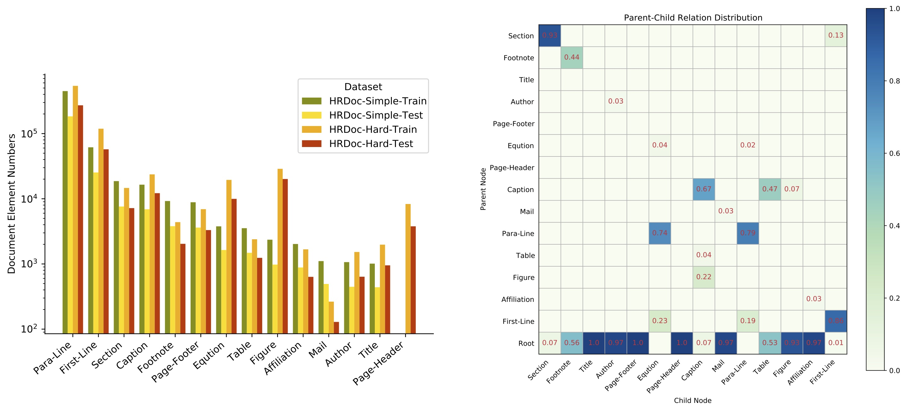
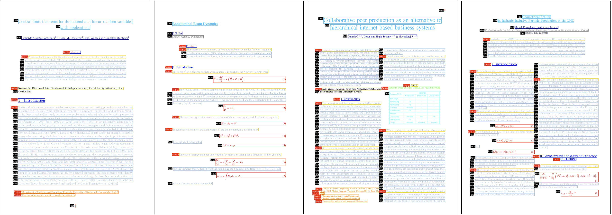

# HRDoc

This is the official PyTorch implementation of our paper: "HRDoc: Dataset and Baseline Method Toward Hierarchical Reconstruction of Document Structures" to be appeared in the AAAI-2023 conference.

We build HRDoc with line-level annotations and cross-page relations that support both NLP and CV research. HRDoc dataset aims to recover the semantic structure of the PDF document, which can be divided into three subtasks, includ- ing semantic unit classification, parent finding, and relation classification.

## Dataset Introduction

HRDoc contains 2,500 documents with more than 2 million semantic units. The following figure provides the statistics of semantic unit distribution over the train and test set of the HRDoc datasets.

Here we present some samples in the HRDoc dataset.

# News
- We updated the class transfer scripts used in our experiment, use `trans_class` function in `utils/utils.py` to transfer HRDS/HRDH `class` label to the one used in our paper.
- We released evaluation tool, please refer to `utils/teds_eval.py`.
- We released some examples for HRDoc datasets, please refer to `examples` folder.
- Our paper has been accepted by the AAAI-2023 conference!
- We have added extended experiment results in our repo.

# Release Issues

We have released scripts related to the data generation, rule-based system and including 4 parts: 
1. The scripts used to get colorized documents. See `utils/pdf_colorization.py`
2. PDF parser systems used to extract the text lines, equation, table, and figure areas. See `utils/extract_pdf_hrdh.py` and `utils/extract_pdf_hrdh.py`
3. The human-designed rule system as a new baseline. See `utils/relation_recover.py`
4. An end2end multi-modal system for reconstruction task. See `end2end_system` folder

The HRDS dataset and HRDH dataset have been released! Google drive([HRDS](https://drive.google.com/file/d/16a-_46htAcHs7zSRU_c1ohObd9BxGZ83/view), [HRDH](https://drive.google.com/file/d/1q7jHOuX3IF9lOC4aDSOlzEIet4q3NUN9/view)).

# Results

### Classification results on HRDoc-Simple (F1 %)
| Model                                           |  Title  |  Author | Mail    | Affili  | Section | Fstline |Paraline | Table   |  Figure | Caption | Equation| Footer  | Header  | Footnote | Micro   |  Macro  |
| ----------------------------------------------  |  -----  |  -----  |  -----  |  -----  |  -----  |  -----  |  -----  |  -----  |  -----  |  -----  |  -----  |  -----  |  -----  |  -----   |  -----  |  -----  |
| Cascade-RCNN                                    |  78.83  |  72.74  |  64.54  |  70.13  |  91.35  |  87.53  |  89.70  |  89.30  |  73.87  |  64.87  |  83.87  |  87.50  |    -    |  79.32   |  88.30  |  80.85  |
| ResNet+RoIAlign (ImageNet)                      |  93.67  |  82.53  |  81.33  |  84.39  |  37.09  |  38.39  |  91.86  |  58.44  |  48.53  |  70.75  |  26.89  |  98.33  |    -    |  49.76   |  85.61  |  66.30  |
| ResNet+RoIAlign (PubLayNet)                     |  85.35  |  46.98  |  25.43  |  60.73  |  14.22  |  16.26  |  89.94  |  29.42  |  40.63  |  49.67  |  8.21   |  96.07  |    -    |  0.20    |  81.78  |  43.32  |
| Sentence-Bert                                   |  98.98  |  96.47  |  98.95  |  97.42  |  97.30  |  93.27  |  98.72  |  94.42  |  95.72  |  93.36  |  96.02  |  99.89  |    -    |  87.11   |  97.74  |  95.97  |
| LayoutLMv2                                      |  96.61  |  97.70  |**99.69**|**99.17**|  98.80  |  97.98  |  99.62  |  99.12  |  98.71  |  98.04  |**98.13**|  99.97  |    -    |  97.19   |  99.31  |  98.52  |
| DSPS Encoder (Rule-based dataset for training)  |  98.31  |  96.16  |  92.48  |  94.72  |  98.89  |  94.23  |  99.28  |  0.0    |  0.0    |  85.79  |  66.32  |  99.93  |    -    |  96.65   |  97.50  |  78.67  |
| **DSPS Encoder**                                |**99.43**|**98.83**|  96.45  |  97.33  |**99.60**|**98.22**|**99.74**|**100.0**|**99.95**|**99.06**|  97.91  |**100.0**|    -    |**99.15** |**99.52**|**98.90**|

* We trained LayoutLMv2 on the HRDoc-Simple dataset with a batch size of 3 (page-level) for 30,000 steps, the training stage costs about 4.5 hours on single NVIDIA V100-24G GPU.
* `ResNet+RoIAlign (PubLayNet)` indicates the model pretrained on PubLayNet using FastRCNN with Resnet-50. The poor results may be casued by the gap between instance segmentation task and instance classification task.
* `DSPS Encoder (Rule-based dataset for training)` indicates the results when trained on the data from the PDF parser system and evaluated on the manually rechecked test set. Here for HRDS we delete all image/table elements in our rule-based dataset, and obtain their rough bounding boxes using Cascade-RCNN trained on about 1000 manually labeled document pages. (That's why the model achieves 0.0 F1-score in classifying Table/Figure categories) The detection configure file is posted on `end2end_system/detection`.

### Classification results on HRDoc-Hard (F1 %)
| Model                                           |  Title  |  Author | Mail    | Affili  | Section | Fstline | Paraline | Table   |  Figure | Caption | Equation | Footer  |  Header | Footnote | Micro   |  Macro  |
| ----------------------------------------------  |  -----  |  -----  |  -----  |  -----  |  -----  |  -----  |  -----   |  -----  |  -----  |  -----  |  -----   |  -----  |  -----  |  -----   |  -----  |  -----  |
| Cascade-RCNN                                    |  81.50  |  49.77  |  33.39  |  49.34  |  75.92  |  64.96  |  77.86   |  69.96  |  72.22  |  43.72  |  68.84   |  70.91  |  71.00  |  52.67   |  73.37  |  64.94  |
| ResNet+RoIAlign (ImageNet)                      |  82.40  |  48.40  |  18.43  |  61.33  |  33.66  |  45.37  |  87.99   |  21.89  |  70.28  |  61.54  |  48.32   |  73.69  |  75.71  |  6.79    |  79.25  |  52.56  |
| ResNet+RoIAlign (PubLayNet)                     |  76.00  |  33.10  |  0.00   |  47.25  |  6.73   |  26.02  |  84.58   |  3.97   |  43.78  |  37.81  |  24.41   |  50.59  |  64.34  |  4.25    |  73.46  |  35.92  |
| Sentence-Bert                                   |  95.85  |  89.92  |**91.68**|**91.75**|  94.26  |  88.68  |  96.77   |  76.96  |  91.67  |  91.99  |  93.94   |  94.68  |  92.65  |  62.61   |  94.68  |  89.53  |
| LayoutLMv2                                      |  97.61  |  91.43  |  87.02  |  91.16  |  96.02  |**91.59**|  97.74   |  92.33  |  97.42  |  97.02  |  95.22   |**98.56**|**98.11**|  76.19   |  96.36  |  93.39  |
| DSPS Encoder (Rule-based dataset for training)  |  94.98  |  82.96  |  0.0    |  52.73  |  94.62  |  85.54  |  96.78   |  84.85  |  95.39  |  95.26  |  96.67   |  91.85  |  85.92  |  87.57   |  94.37  |  81.79  |
| **DSPS Encoder**                                |**97.71**|**93.93**|  85.49  |  90.95  |**96.06**|  91.24  |**97.96** |**100.0**|**100.0**|**97.32**|**97.92** |  98.54  |  97.83  |**88.84** |**96.74**|**95.27**|

* We trained LayoutLMv2 on the HRDoc-Hard dataset with a batch size of 3 (page-level) for 40,000 steps, the training stage costs about 6 hours on single NVIDIA V100-24G GPU.
* `ResNet+RoIAlign (PubLayNet)` indicates the model pretrained on PubLayNet using FastRCNN with Resnet-50. The poor results may be casued by the gap between instance segmentation task and instance classification task.

### ResNet-50 pretraind on PubLayNet
|  bbox_mAP  |  bbox_mAP_50  |  bbox_mAP_75  |
|  --------  |  -----------  |  -----------  |
|  0.9170    |  0.9660       |  0.9470       |

* We trained a FastRCNN network using ResNet-50 as visual backbone on the PubLayNet dataset. The experiment was conducted on 2 Nvidia A100-48G GPU for 3 days with a batch size of 50.